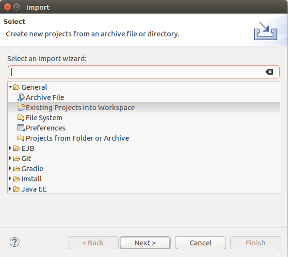
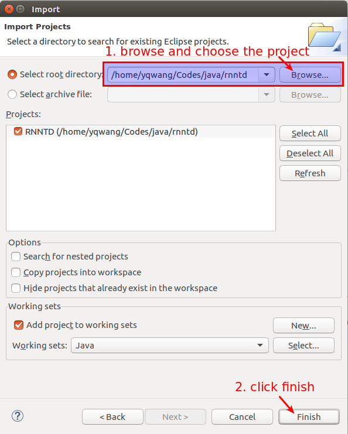
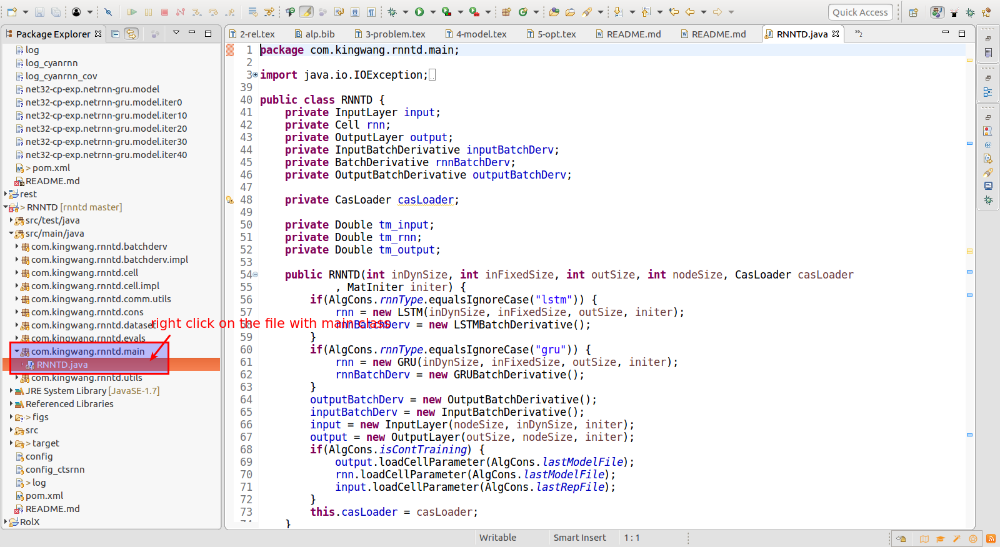
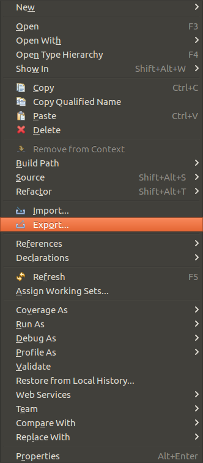
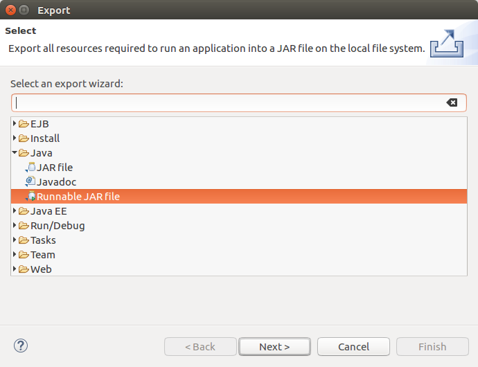
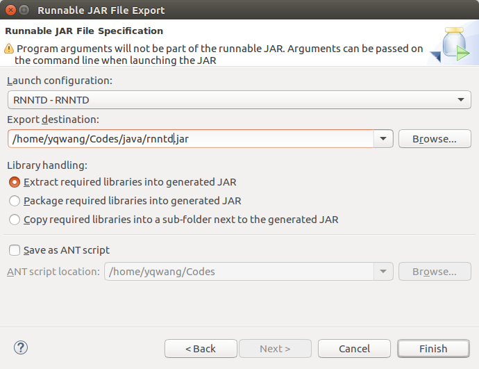

# RNN-TD

This repository enables the reproduction of the experiments described in the article:

[Yongqing Wang, Shenghua Liu, Huawei Shen, Jinhua Gao and Xueqi Cheng. Marked temporal dynamics modeling based on recurrent neural network. The 21st Pacific-Asia Conference on Knowledge Discovery and Data Mining (PAKDD-17). Jeju, South Kore, 2017: pp. 786-798.](http://dx.doi.org/10.1007/978-3-319-57454-7_61)

The dataset used in the project can be found in 
[my personal website](https://pan.baidu.com/s/1qXL4zAO)

****

# Content
* [Requirements](#requirements)
* [Usage](#usage)
   * Install the project
   * (Optional) Compile and packaging by Eclipse
   * Running
* [Specfication](#specfication)
   * The architecture of "src" directory

****

## Requirements

- maven==3.*
- jdk==1.8
- (optional) Eclipse
> You'd better install maven plugin in eclipse (the lastest version has already installed maven plugin)

[back to top](#readme)

## Usage

### Install the project

```bash
git clone git@github.com:Allen517/rnntd.git
cd rnntd
mvn clean install
```

If you want to load the project in Eclipse, you should run the following command

```bash
mvn eclipse:eclipse
```

### (Optional) Compile and packaging by Eclipse

* Import a project and import "Existing Projects into Workspace"



* Click "Browse", choose "rnntd" project and click "Finish"



* Export a "Runnable JAR file"

> Right click on the main procedure



> Choose "Export"



> Choose "Runnable JAR file"



> Completed



### Running

```bash
java -jar rnntd.jar config

```
> move the runnable jar (e.g., the jar file is called "cyanrnn.jar") into the directory of cyanrnn_project

[back to top](#readme)

## Specfication

### The architecture of "src" directory

* main.java.com.kingwang.netattrnn

> batchderv (When minibatch is finished, batchderv will average the derivation in all batches.)

>> BatchDerivative.java: interface of BatchDerivative

>> impl

>> --GRUBatchDerivative.java: for GRU (RNN)

>> --InputBatchDerivative.java: for input layer

>> --LSTMBatchDerivative.java: for LSTM (RNN)

>> --OutputBatchDerivative.java: for output layer

> cell

> --Cell.java: interface of RNN layers

> --Operator.java: basic operator for RNN layers

> impl

>> --GRU: GRU implementation

>> --LSTM: LSTM implementation

>> --InputLayer: Input layer implementation

>> --OutputLayer: Output layer implementation

> main

>> RNNTD: Main procedure of RNN-TD

> comm/utils: Common utilities

> cons: Constants

> dataset: Implementation of loading dataset

> evals: Implementation of RNN-TD validation in tranining process
 
> utils: Common utilities for RNN-TD

[back to top](#readme)
